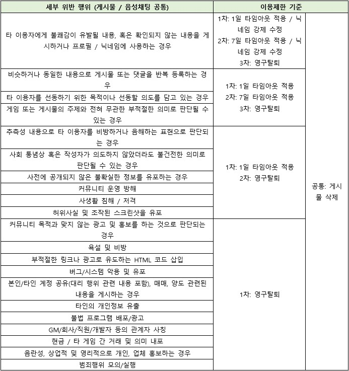
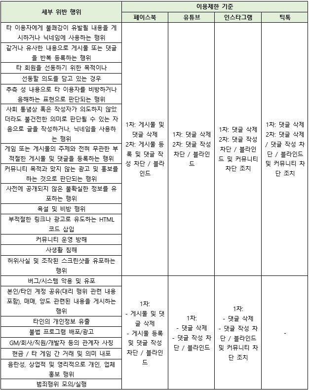

# 📜 Operation policy

1\. 일반 원칙

1.1. “게임명" 네이버 카페, 페이스북, 유튜브, 인스타, 디스코드, 틱톡 등 회사의 공식 커뮤니티 사이트 (이하 “공식 커뮤니티”)는 회원이 “게임명 서비스”를 이용하는데 필요한 각종 정보의 교환, 일상적인 대화, “회사명(이하 "회사")” 및 “게임명 서비스”에 대한 의견 공유 등을 위한 목적으로 마련되었습니다.

1.2. “회사”는 본 원칙을 바탕으로 건전한 커뮤니티를 조성하고 안정된 커뮤니티 서비스를 제공을 위해 최선을 다합니다.

1.3. “회사”는 커뮤니티 내의 이용자 간 분쟁에 개입하지 않는 것을 원칙으로 합니다. 단, 문제의 심각성이나 다수 커뮤니티 이용자들에게 주는 악영향의 정도를 판단하여 부분적으로 개입하거나 중재할 수 있습니다. 또한 그 경중 및 커뮤니티 운영 원칙 3항에 근거하여 사전 경고 없이 커뮤니티 이용을 제한할 수 있습니다.

1.4. “회사”는 건전한 커뮤니티의 정착을 위하여 커뮤니티 운영원칙 3항에서 정의한 ‘사회통념상 받아들이기 어려운 행위’에 해당하는 게시물 및 댓글을 사전 통지 없이 삭제할 수 있으며, 커뮤니티 운영 원칙 3항에 근거하여 사전 경고 없이 커뮤니티 이용을 제한할 수 있습니다.

1.5. “회사”는 게시판의 성격에 맞지 않는 게시물을 다른 게시판으로 이동시킬 수 있습니다.

1.6. 본 원칙에서 정하지 아니하는 사항과 본 원칙의 해석에 관하여는 ‘이용약관’을 따르고, 그 외의 사항에 대하여는 관계 법령 및 상 관례를 따릅니다.

&#x20;

2. 공식 커뮤니티의 회원제 운영 정책

2.1. 공식 디스코드는 회사에서 제공한 디스코드 서버 링크 혹은 디스코드 초대 링크를 통해 가입할 수 있으며, 각종 채팅 채널 및 대화 채널의 이용이 가능합니다. 단, 회사에서 플랫폼, 특정 지역, 나이, 언어, 관심사, 성별 등을 구분하여 참여가 필요하다고 판단되는 채널의 경우, 제한을 설정하여 발행할 수 있습니다.

&#x20;

3\. 불건전 행위에 대한 기준 및 제재

3.1. 불건전 행위란 공식 커뮤니티 운영 원칙에서 명시된 사항을 위반하는 행위로써 정상적인 커뮤니티 사이트의 서비스 운영, 이용을 방해하거나 다른 회원에게 피해 및 혐오감을 주는 행위, 사회 통념상 받아들이기 어려운 행위를 말합니다.

3.2. 사회 통념상 받아들이기 어려운 행위는 아래와 같습니다.

&#x20; \- 욕설/비어/속어를 사용하는 행위

&#x20; \- 선정적이고 저속한 행위

&#x20; \- 회사 및 기타 제3자의 상표권, 저작권을 침해하거나 침해했다고 판단되는 행위

&#x20; \- 운영자(또는 GM / CM), 개발자, 회사 명칭 등 “게임명”과 연관 사칭 또는 사기의 소지가 있는 행위

&#x20; \- 특정 정치인이나 정당 등을 비방하거나 옹호한다고 판단되는 행위

&#x20; \- 현금거래 및 계정거래의 의도가 있다고 판단되는 행위

&#x20; \- 비공식 프로그램, 매크로 등 회사가 제공 승인하지 않은 프로그램을 유포하는 행위

&#x20; \- 고의성을 가지고 해를 끼칠 목적으로 한 행위

&#x20; \- 사행행위를 조장하거나 이용하려는 내용이 포함된 게시물 및 댓글을 등록하는 행위

&#x20; \- 불법적인 행위와 관련되었다고 판단되는 행위

&#x20; \- 특정 종교, 인종, 국가, 집단 등을 비하하거나 비하할 의도가 있다고 판단되는 행위

&#x20; \- 개인 혹은 집단에 확인되지 않은 내용 혹은 허위 사실을 유포하는 행위

&#x20; \- 기타 다른 이용자에게 불쾌감을 유발하거나 불편함을 느끼게 한다고 판단되는 행위

&#x20; \- 죽음 조장 및 신체 훼손을 의미하는 표현 판단 행위

&#x20; \- 고인 비난, 모독하는 표현으로 판단되는 행위

&#x20; \- 성적 수치심 및 혐오감을 불러일으키는 표현 판단 행위

&#x20; \- 출처가 불분명한 URL, 음란 사이트 등이 포함된 게시물 및 댓글을 등록하는 행위

&#x20; \- 사회적으로 부정적인 의미를 내포하고 있는 은어를 사용하는 행위

&#x20; \- 도배성 게시물 등록으로 판단되는 행위

&#x20; \- 음란성, 상업적 및 영리적으로 개인, 업체 홍보성 게시물 및 댓글을 등록하는 행위

&#x20; \- 비정상적인 방법으로 이득을 취하거나 유포하는 행위

&#x20; \- 게임 서비스 운영을 방해하려는 목적의 게시물 등록

&#x20; \- 타인의 개인정보를 노출시키려는 행위

&#x20; \- 본인 및 타인의 계정 및 비밀번호 등의 정보를 공유 (대리 행위 관련 내용 포함)하는 행위

&#x20; \- 게임 또는 게시물의 주제와 전혀 무관한 게시물 및 댓글을 등록하는 행위

3.2.1. 이용자가 등록한 게시물이 아래 유형에 해당하거나 유사한 것으로 판단될 경우, 회사는 해당 게시물을 저작권을 침해하거나 침해했다고 판단되는 행위로 간주합니다.

\- 저작자의 사용허락을 받지 않고 사진, 음악, 동영상을 링크하거나 게시하는 경우

\- 언론사의 뉴스 기사(글, 사진)를 그대로 가져와 게시하는 경우\
(뉴스 기사의 출처가 있다고 하더라도 뉴스 기사를 그대로 가져와 게시하는 것은 저작권 침해에 해당하며 해당 언론사의 뉴스 기사로 링크되는 주소를 게시하는 것은 가능)

\- 뉴스 기사의 헤드라인을 게시물의 제목으로 사용하는 경우

\- 방송 프로그램(드라마, 음악프로그램 등)을 캡처하여 게시물로 게시하는 경우

3.2.2. 이용자가 직접 게임 또는 커뮤니티 내에서 이름을 부여하는 모든 종류의 명칭(길드명, 직위명, 캐릭터명, 기타 등)이 아래의 유형과 같거나 유사할 경우, 운영자(또는 GM / CM), 개발자, 회사 명칭 등 “게임명”과 연관 사칭 또는 사기의 소지가 있는 행위로 간주합니다.

\- 현금, 현물거래 혹은 계정거래의 의도가 있다고 판단되는 명칭

\- 선정적이고 음란한 내용이거나 이를 연상하게 하는 것으로 판단되는 명칭

\- 반사회적이거나 관계법령에 저촉되는 내용의 명칭

\- 제3자의 저작권 및 상표권을 침해할 수 있는 명칭

\- 욕설이나 비속어 등을 사용하여 타인에게 불쾌감을 줄 수 있는 명칭

\- 욕설의 철자나 단어를 바꾸는 등 욕설 내용을 연상하게 하는 모든 형태의 명칭

\- GM 및 당사 소속직원을 사칭할 가능성이 있거나, 오해의 소지가 있다고 판단되는 명칭

\- 인종/종교/성/민족적인 차별에 관한 사항이 내포되어 있는 명칭

\- 이용자의 계정정보가 포함되어 개인정보 유출이 우려되는 명칭

\- 기타 불쾌감 및 성적 상상을 일으킬 수 있는 명칭

3.3. 불건전 행위를 “회사”가 확인하는 경우, “회사”는 커뮤니티 운영 원칙에서 정한 바에 따라 다음의 기준에 의거하여 커뮤니티 사이트 이용을 제한할 수 있습니다.

\[디스코드 이용제한 기준]

<figure><figcaption></figcaption></figure>

\[페이스북, 유튜브, 인스타그램 이용제한 기준]

<figure><figcaption></figcaption></figure>

※ 위의 항목에 구체적으로 해당되지 않는 사항이라 하더라도 회사의 공식 커뮤니티 서비스 제공에 부정적인 영향을 주거나, 다른 이용자 간의 커뮤니티에 악영향을 끼치는 경우, “게임명” 운영정책에 의거하여 서비스 이용이 제한될 수 있으며 사례가 누적되는 건에 대해서는 가중 처리될 수 있습니다.

※ 커뮤니티 영구탈퇴를 당할 경우 재가입이 불가할 수 있습니다.
