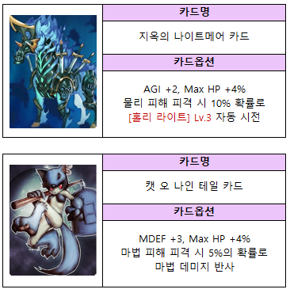

# 🥾 신발

<mark style="color:green;">**■ 초록색 카드**</mark>

<figure><figcaption></figcaption></figure>

<mark style="color:blue;">**■ 파란색 카드**</mark>

<figure><figcaption></figcaption></figure>

<mark style="color:purple;">**■ 보라색 카드**</mark>

<figure><figcaption></figcaption></figure>

<mark style="color:yellow;">**■ 황금색 카드**</mark>

<figure><figcaption></figcaption></figure>
