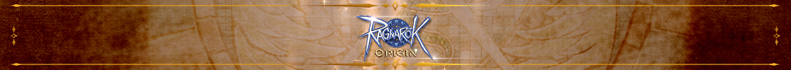

# \[가이드] 37. 스페셜 이벤트 - 포링 눈사람 만들기 (Update 21.12.21)

**Beyond Ragnarok!**

라그나로크 그 이상을 담다.

&#x20;

안녕하세요.

라그나로크 오리진의 GM세니아입니다.&#x20;

&#x20;&#x20;

이번 가이드에서는

‘포링 눈사람 만들기 이벤트’에 대해 설명해드릴게요 :)

&#x20;

모험가님들이 제출하는 재료를 통해 산타클로스가 포링 눈사람을 만들어요!

&#x20;

제출한 재료의 수량에 따라 포링 눈사람이 모습이 달라지며,

많은 재료를 아르슈에게 제출할수록 점점 더 멋진 포링 눈사람으로 변화해요.

&#x20;

다 같이 멋진 포링 눈사람을 만들어보아요\~!

&#x20;

&#x20;

<mark style="color:blue;">**■ 이벤트 안내**</mark>

\- 레벨 제한 : Base Lv.25 이상

&#x20;

<mark style="color:blue;">**■ 이벤트 진입 방법**</mark>

&#x20;

\- 우측 상단의 \[EP3.0 눈꽃 축제] 아이콘을 터치하면 이벤트 목록에서 포링 눈사람 만들기를 확인할 수 있습니다.

\- 포링 눈사람 만들기 이벤트를 선택하면 \[구경하러 가기] 버튼이 활성화 되며, 터치 시 포링 눈사람이 위치한 자리로 이동할 수 있습니다.

&#x20;

&#x20;

<mark style="color:blue;">**■ 이벤트 이용 안내**</mark>

&#x20;

1\. 몬스터 스노우 카니발, 눈싸움 대결, 눈밭에서 보물찾기 이벤트에서 각각 한 가지 재료를 획득할 수 있습니다.

&#x20;

&#x20;

2\. 해당 이벤트들을 진행 완료할 경우 액세서리, 마법 결정, 눈꽃 아이템들을 획득할 수 있습니다.

3\. 해당 재료들을 모을경우 위와 같이 아이템 개수가 갱신되며, 각각 최소 3개의 아이템을 획득할 시 제출이 가능합니다.

&#x20;

&#x20;

<mark style="color:blue;">**■ 이벤트 보상 지급 조건**</mark>

\- 3종 재료를 최소 1회씩 제출해야만 산타클로스의 단계별 보상을 획득할 수 있습니다.

&#x20;

&#x20;

<mark style="color:blue;">**■ 단계별 잠금 보상 해제 조건**</mark>

1\. 단계별 잠금 보상은 단계 목표에 도달할 시 다음 날 새벽 5시에 해제됩니다.

2\. 제출해야 할 단계 보상을 초과하더라도 매일 1단계씩만 해제됩니다.

3\. 보상 단계 바의 경우 단계별로 오픈될 때마다 산타클로스가 루돌프를 보내 모험가님들에게 우편으로 단계 보상을 지급합니다.

&#x20;

<mark style="color:blue;">**■  단계별 잠금 해제 보상**</mark>

&#x20;  1단계 : 산타 모자, 눈꽃 추첨권\*1

&#x20;  2단계 : 칭호-스노우 카니발에는 말이야, 눈꽃 추첨권\*1

&#x20;  3단계 : 순록소년 프로필, 눈꽃축제코인\*30

&#x20;  4단계 : 크리스마스 달콤 프로필, 눈꽃축제코인\*30

&#x20;  5단계 : 눈사람 모자, 눈꽃축제코인\*30

&#x20;

&#x20;

<mark style="color:blue;">**■ 설원의 사도 이벤트 교환 상점**</mark>

&#x20;

\- 액세서리, 마법 결정, 눈꽃 등 재료 아이템을 제출할 시 장식 수정, 수정 에너지 스톤, 눈꽃 결정 아이템을 획득할 수 있습니다.

\- 장식 수정, 수정 에너지 스톤, 눈꽃 결정 아이템의 경우 \[설원의 사도 이벤트 상점]에서 다른 아이템으로 교환이 가능합니다.

&#x20;

&#x20;

&#x20;

&#x20;

&#x20;

<mark style="color:red;">**※ 참고 사항**</mark>

\- 단계별 잠금 보상과는 상관 없이 보상은 계속 제출할 수 있습니다.

\- 서버 내 모험가님들이 제출하는 이벤트 재료의 총 개수가 집계됩니다. (ex. 프론테라 전체 제출 개수 1,000개)

\- 지급된 우편 보상을 기간 내에 수령하지 않은 경우 추가 재지급등의 도움은 드리기 어렵습니다.

&#x20;

<mark style="color:red;">**\*본 가이드는 테스트 서버를 기반으로 제작되어, 업데이트 시 일부 내용이 수정될 수 있습니다.**</mark>

&#x20;

&#x20;

&#x20;                                                                                         최고의 기쁨과 감동을 선사할 라그나로크 오리진

&#x20;                                                                                                                 새로운 이야기 이제, 시작 합니다.

&#x20;

&#x20;                                                                                                                                    RAGNAROK ORIGIN

<figure><figcaption></figcaption></figure>
