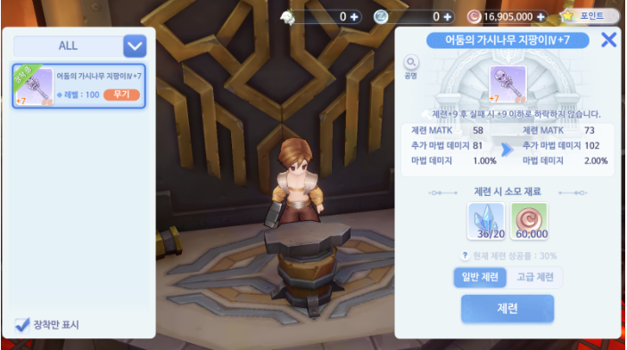

# \[상급자 가이드] 29. 장비 – 제련 (Update 21.04.15)

Beyond Ragnarok!

라그나로크 그 이상을 담다♡

&#x20;

안녕하세요,

라그나로크 오리진의 GM 세니아예요\~

&#x20;

기본적으로 강력해지는 방법 중에 하나로

이번 가이드에서는 제련에 대해 알려드릴게요\~

지금 바로 장비 상점으로 제련하러 가보죠!\
&#x20;

**▣ 제련**

제련은 Base Lv. 35에 열립니다!

장비 상점의 NPC 홀그렌 장비 제련사를 통해 제련을 진행할 수 있습니다.

**▣ 일반 제련**

일반 제련은 각 장비 제련에 맞는 강화재료인 오리데오콘이나&#x20;

에르늄에 낙원단 주화를 소모하여 진행할 수 있습니다.

\+0\~+9 제련 시 각 장비에 맞는 강화 재료인 오리데오콘이나 에르늄이 필요하며

\+10이상 제련 시에는 농축 오리데오콘이나 농축 에르늄이 필요한 점 참고해 주세요!

&#x20;

.png)

제련 성공과 관련해서는 물음표 버튼을 통해 보다 자세한 설명을 확인할 수 있습니다\~

&#x20;

**▣ 고급 제련**

고급 제련은 일반 제련에 소모되는 재료와 **'대장장이 신'** 아이템 또는 **'고급 대장장이 신'** 아이템을 선택하여 진행할 수 있습니다.

'**대장장이 신**의 눈물 또는 심장'을 사용 시 제련하게 되면 제련 실패 시 제련도가 하락하지 않습니다\~

'**고급 대장장이 신**의 눈물 또는 심장'을 사용하게 되면 제련 성공률이 상승하고 제련에 실패해도 제련도가 하락하거나 파손되지 않는 차이점이 있으니 사용 시 유의해주세요!

&#x20;

제련은 최대 +20까지 가능하며, +16이상 달성한 장비의 경우 파손되지 않는 점 참고해 주시길 바랍니다.

&#x20;

**▣ 제련 이펙트**

마지막으로 공명 활성화 후 공명 6단계 달성 시 \
아래 이미지와 같이 무기에 푸른색의 이펙트가 노출되는데요\~&#x20;

공명 8단계 달성 시에는 아래 이미지처럼 푸른색에서 금빛 이펙트로 변경됩니다!

모험가님들의 제련에 성공이 깃들기를 기원하며 번쩍번쩍 멋있는 무기를 통해 즐거운 사냥을 진행하셨으면 좋겠습니다\~

&#x20;

감사합니다.

&#x20;

&#x20;

<mark style="color:red;">**\* 본 가이드는 테스트 서버를 기반으로 작성된 내용으로, 정식 서버와는 다소 차이가 있거나 수정될 수 있습니다.**</mark>

&#x20;

최고의 기쁨과 감동을 선사할 라그나로크 오리진  　　　

새로운 이야기 이제, 시작합니다.  　　　

&#x20;

RAGNAROK ORIGIN  　　　

